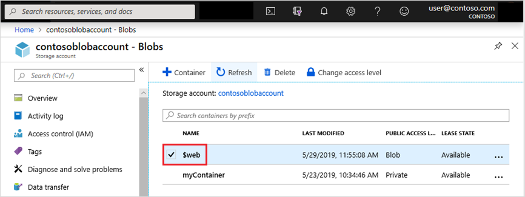

# Static website hosting in Azure Blob Storage

Given you have a react web app, you want to deploy it onto Azure. As it doesn't have any server-side code, you can deploy it on Azure Blob storage, replicated on Azure CDN. All the requests would be served by CDN and it would be fast, reliable, and cost-saving. 

## Setting up

Create a storage account with blob storage. Then enable static website on the storage account. It'll ask you what would be the name of the default file. I chose index.html, as it's the default html file of my react app. 

Once enabled, it'll create $web directory / folder on the blob container.

It shows the endpoint: https://contoso.web.core.windows.net 

### Uploading content

You can use any of these tools to upload content to the $web container.

* [Azure CLI](https://docs.microsoft.com/en-us/azure/storage/blobs/storage-blob-static-website-how-to?tabs=azure-cli)
* [Azure PowerShell module](https://docs.microsoft.com/en-us/azure/storage/blobs/storage-blob-static-website-how-to?tabs=azure-powershell)
* [AzCopy](https://docs.microsoft.com/en-us/azure/storage/common/storage-use-azcopy-v10)
* [Azure Storage Explorer](https://azure.microsoft.com/features/storage-explorer/)
* [Azure Pipelines](https://azure.microsoft.com/services/devops/pipelines/)
* [Visual Studio Code extension](https://docs.microsoft.com/en-us/azure/javascript/tutorial-vscode-static-website-node-01)

I used Azure Storage Explorer for testing purpose, but would set up an Azure Pipeline to deploy the change automatically whenever a new commit gets pushed. 

 add the custom domain: servicesoverview.clearbank.co.uk to the azure cdn

* cdn it uses azure cdn: servicesoverview.azureedge.net set custom domain now

  Origin Origin type: storage -&gt; Custom origin Origin hostname: servicesoverview.blob.core.windows.net -&gt; servicesoverview.z33.web.core.windows.net Origin host headser: -&gt; servicesoverview.z33.web.core.windows.net

